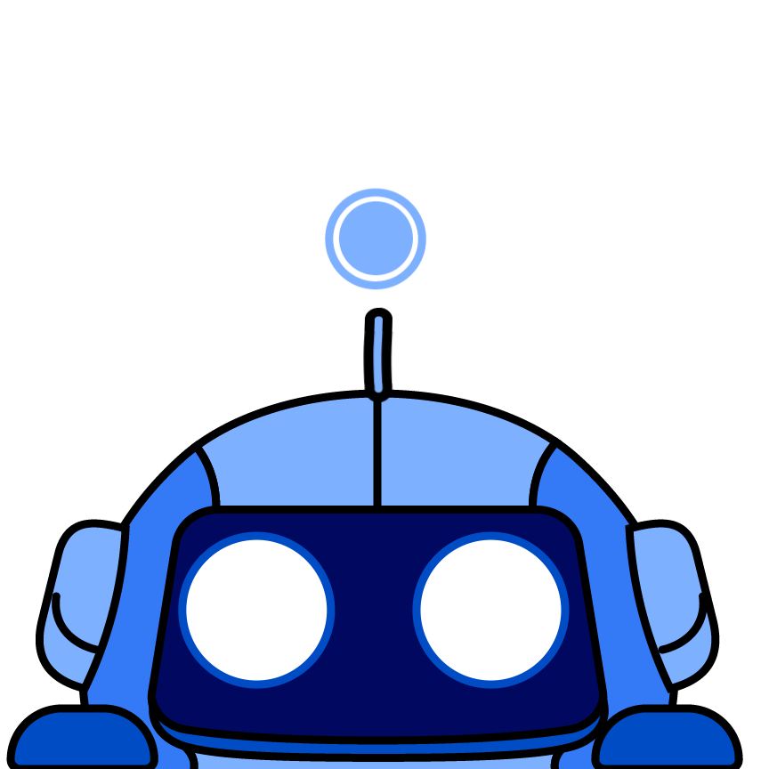

   
   <h1 align="center">Paige: AI Frontend Engineer</h1>

<!-- BADGES -->

   
   
   

Meet Paige, our AI frontend engineer designed to make frontend development 10x easier and faster.

Paige makes building and modifying websites a breeze. Simply describe or highlight what you want done on your website, and Paige will search through your codebase, understand the structure, and make the necessary changes.

## 🚀 Getting Started

Coming soon...

## 📚 Documentation

To learn more about Paige and how to use it, check out our [documentation](https://paige.sh/docs/).

> [!WARNING]
> Paige makes changes locally. Be sure to back up your files with git before running the app.

## About Us

Built by Speck (YC W24)
